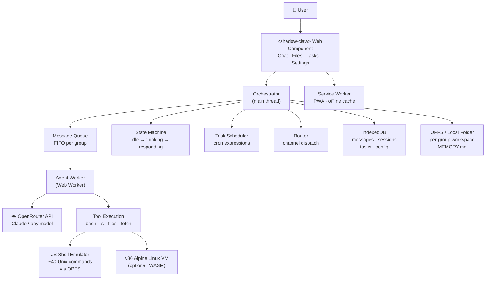
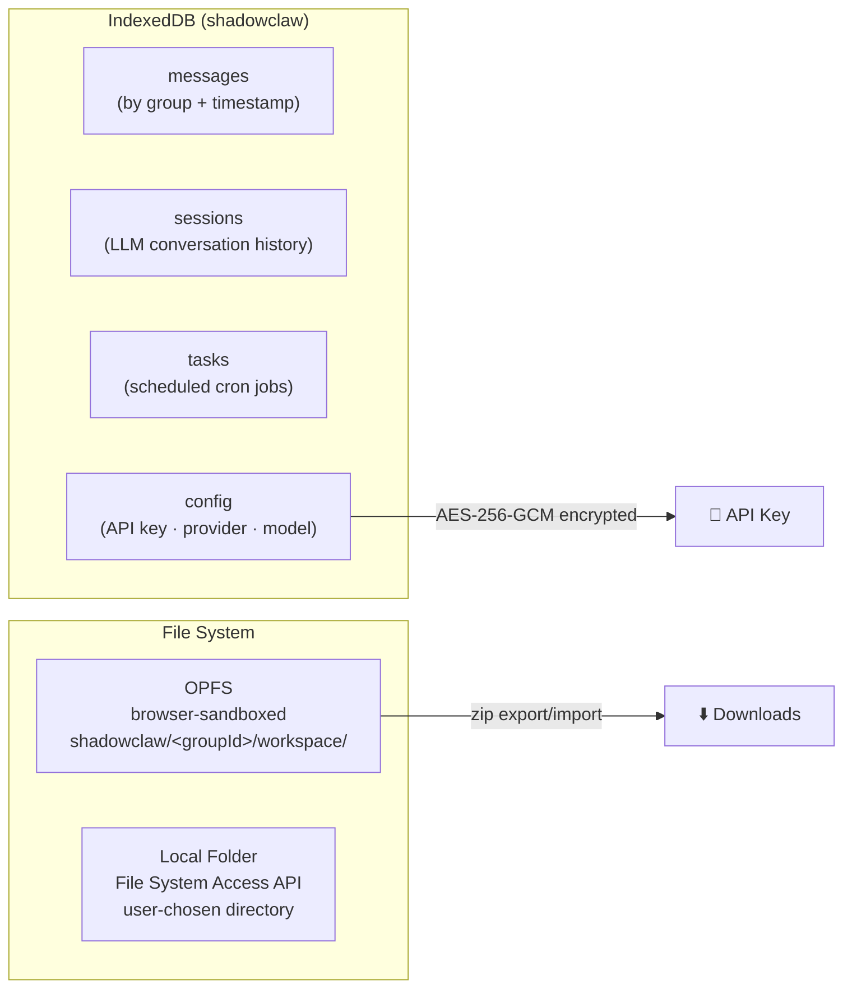

# 🦞 [ShadowClaw](https://xt-ml.github.io/shadow-claw/)

[](https://deepwiki.com/xt-ml/shadow-claw)


Browser-native personal AI assistant. A complete reimagination of NanoClaw — same
single-user, small-enough-to-understand philosophy, but running entirely in a browser
tab with no build step, no framework, and zero runtime dependencies.

## Quick Start

```bash
npm install
npm start        # Express dev server → http://localhost:3000
```

Open Settings, paste your [OpenRouter](https://openrouter.ai/) API key, and start chatting.

## Architecture



### Message Flow

```mermaid
sequenceDiagram
    participant U as User
    participant UI as Web Component
    participant O as Orchestrator
    participant IDB as IndexedDB
    participant W as Agent Worker
    participant OR as OpenRouter

    U->>UI: types message
    UI->>O: submitMessage()
    O->>IDB: saveMessage()
    O->>W: postMessage({type:'invoke'})
    W->>OR: POST /chat/completions
    OR-->>W: tool_use response
    W->>W: executeTool() → OPFS / fetch / JS
    W->>OR: POST (tool result)
    OR-->>W: final text response
    W->>O: postMessage({type:'response'})
    O->>IDB: saveMessage()
    O->>UI: signal update → re-render
```



## Key Files

| File | Purpose |
|------|---------|
| `index.mjs` | App entry — opens IndexedDB, boots orchestrator, registers SW |
| `worker.mjs` | Agent Web Worker — owns the LLM tool-use loop |
| `src/orchestrator.mjs` | State machine, message queue, agent invocation, task scheduling |
| `src/tools.mjs` | Tool schema definitions sent to the LLM |
| `src/shell.mjs` | Pure-JS bash-like shell emulator (OPFS filesystem) |
| `src/vm.mjs` | Optional v86 Alpine Linux VM (falls back to JS shell) |
| `src/db.mjs` | IndexedDB layer — messages, sessions, tasks, config |
| `src/storage.mjs` | OPFS + Local Folder file storage, zip export/import |
| `src/crypto.mjs` | AES-256-GCM encryption for API keys at rest |
| `src/providers.mjs` | LLM provider registry (OpenRouter + future providers) |
| `src/router.mjs` | Routes inbound messages to channels |
| `src/channels/browser-chat.mjs` | Browser chat channel implementation |
| `src/task-scheduler.mjs` | Cron expression parser and task runner |
| `src/stores/` | Reactive signal-based UI state (orchestrator, file-viewer, theme) |
| `src/components/` | Web Components — `<shadow-claw>`, tasks page, files page |
| `src/config.mjs` | All constants, provider definitions, and config keys |
| `src/types.mjs` | JSDoc `@typedef` declarations (full type contract) |
| `src/effect.mjs` | Lightweight `effect()` using TC39 Signal Polyfill |
| `bin/serve.mjs` | Express dev/prod server with compression and SPA routing |
| `service-worker/` | Workbox-generated PWA service worker |

## Tools Available to the Agent

| Tool | What it does |
|------|-------------|
| `bash` | Shell commands — JS emulator or full Alpine VM if assets present |
| `javascript` | Run JS in an isolated `Function` scope — no DOM, no network |
| `read_file` / `write_file` / `list_files` | OPFS workspace file I/O |
| `fetch_url` | HTTP requests via browser `fetch()` — CORS applies |
| `update_memory` | Write to `MEMORY.md` — loaded as system context every invocation |
| `create_task` / `list_tasks` / `update_task` / `delete_task` | Scheduled task management |
| `enable_task` / `disable_task` | Toggle task execution |

## Storage



## WebVM (Optional `bash` Backend)

The `bash` tool has two execution tiers:

1. **JS Shell Emulator** (`src/shell.mjs`) — always available, no assets needed.
   Implements ~40 Unix commands (`cat`, `grep`, `sed`, `awk`, `jq`, `ls`, `mkdir`, etc.)
   against OPFS. Supports pipes, redirects, `&&`/`||`, variable expansion, command substitution.

2. **v86 Alpine Linux VM** — full x86 Linux in WebAssembly. The worker attempts to boot it
   on startup; commands fall back to the JS shell while the VM is booting.

   Serve these files at `/assets/` to enable:

   | File | Description |
   |------|-------------|
   | `alpine-rootfs.ext2` | Alpine Linux root filesystem |
   | `bzImage` | Linux kernel |
   | `initrd` | Initial RAM disk |
   | `v86.wasm` | v86 WebAssembly binary |
   | `libv86.mjs` | v86 JavaScript glue |
   | `seabios.bin` / `vgabios.bin` | Firmware |

## Reactive UI

Vanilla Web Components + **TC39 Signals** (via `signal-polyfill`). A small `effect()`
helper re-runs DOM updates whenever signals change. No virtual DOM, no framework.

## Comparison with NanoClaw

| Feature | NanoClaw | ShadowClaw |
|---------|----------|------------|
| Runtime | Node.js process | Browser tab |
| Agent sandbox | Docker / Apple Container | Web Worker + WebVM |
| Database | SQLite (better-sqlite3) | IndexedDB |
| Files | Filesystem | OPFS + Local Folder |
| Primary channel | WhatsApp | In-browser chat |
| LLM API | Anthropic SDK | OpenRouter (raw fetch) |
| Background tasks | launchd service | Service Worker (PWA) |
| Build step | Required | None (pure ESM) |
| Runtime dependencies | ~50 npm packages | 0 |

## Development

```bash
npm start          # Express dev server
npm test           # Jest (*.test.mjs files live next to source)
npm run tsc        # TypeScript type-check (JSDoc, --noEmit)
npm run build      # Type-check + generate service worker
npm run format     # Prettier
```

## License

AGPLv3. Core logic derived from
[openbrowserclaw](https://github.com/sachaa/openbrowserclaw) (MIT).
